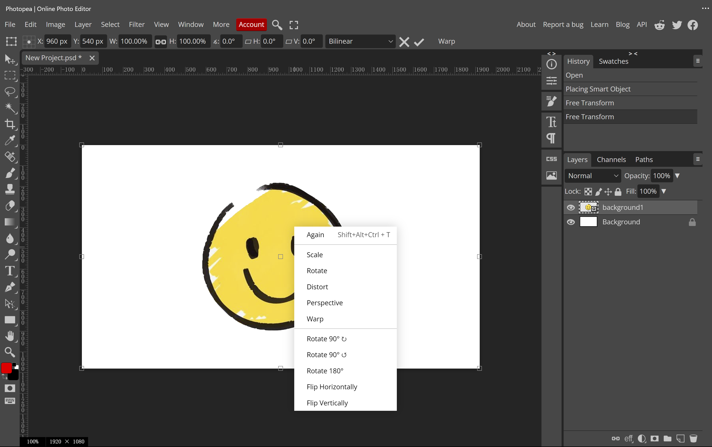

# Photoshop Notes

## Table of content

- [overview](#overview)
- [selects](#selects)
- [layers](#layers)
- [transforms](#transforms)
- [layer styles](#layer-styles)

## overview

---
Photopea is a website aims to bring near-Photoshop experience to low-level users. It has a UI(User interface) that mimics the one of Photoshop. It could be used for editing images and graphical design.

To use Photopea, simply go to its website [photopea.com](https://www.photopea.com/) this basically downloads a small, lightweight version of Photoshop onto your browser and runs it on your browser. Depend on your network, it may take some time to load the website.

You can also install it as a web app. Web apps allow you to open websites as if they are local apps. It is the exact same as opening it on a browser, but you don't see the sometimes annoying browser tabs.

Once you load it, it has a welcome page, which allows you to choose a photo from you computer, or various cloud drives. **Note that since everything is running on your local computer, no photos of your own will be uploaded.**

Similar to `.doc` extension name for word document, or `.pptx` extension for powerpoints, photoshop files uses `.psd` as extension. Photopea also supports other forms of documents, but generally `.psd` files are the most widely supported.

## Selects

<video style="width: 100%;" src="./video/Select Explain Subtitle Output.mp4" controls></video>

---

### Concept

Select allow you to select an area, and your operation afteward will only effect selected area.
It's commonly used in keying.

​	

### Tools

**These tools select area with shape**

Ellipse

Square

**These tools select area with path**

Curve

Straight Line

Curve with magnet

**These Tools select area with uniqueness**

Color

Automatically(magic)

### Some operations for two selected area

**Replace**

**Add**

**Subtract**

**Intersect**

## Layers

<video style="width: 100%;" src="./video/Layer Explain Caption Output.mp4" controls></video>

---

Layer Panel is at the bottom right of the screen by default

### What can it do?

- Change the order of the layers
- Manage the layers: grouping and deleting the layer
- Adjust the opacity, blend option (Black Brother will cover this), blend mode of the layer
- etc.

### Concept

- The top one in the panel will display as the top one in the image
- Users can drag layers up and down in the panel to change the order of layers
- The top image will cover the one under it by default (100% opacity) and will be invisible at 0% opacity
- A good layer panel can keep the project organized.  

## Transforms

<video style="width: 100%;" src="./video/Transform Explain Output.mp4" controls></video>

---

Transformation is a very commonly used shortcut key, which includes common functions such as scaling, rotation, distortion, perspective, horizontal flip, and vertical flip.

We can use these functions to adjust the shape of the image or selected layer at will. 

After calling out the transformation, there will be 8 points in each part of the picture. You can adjust the size and proportion of the photo by dragging different points. Place the mouse on the top of the photo and click and drag the photo to adjust the position of the photo. The desired effect can also be obtained through the superposition of functions.

Drag After selecting the layer, place the mouse on the image and drag it. Scale Ctrl T and drag the origin of the four corners of the picture to zoom in and out proportionally. Rotate After Ctrl T, place the mouse on the outer circle of the picture and drag it clockwise or counterclockwise. Perspective Ctrl T and drag the origin of the four corners of the picture to achieve the perspective effect. distort Ctrl T and drag the origin around the picture to stretch and extrude part of the part. Flip Horizontal and Flip Vertical Ctrl T and then click Flip Horizontal and Flip Vertical to get it.

## Layer Styles

---
Some of the effects for layers are so common that they are included as default on Photopea/Photoshop, including adding colored borders, shadows, etc.

You can view the panel by right clicking the layer and click `blending options`. A new label will show up. There is a selection panel in the right, and a control panel on the left. When the checkbox on each effect is checked, that effect will be applied on the layer.

